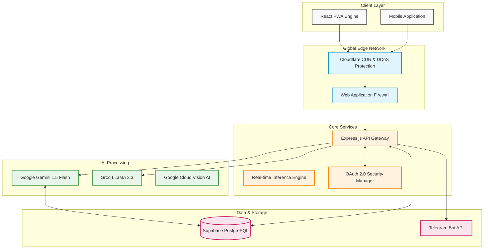

# VisionCure — Enterprise Technical Architecture

> [!TIP]
> This document outlines the technical foundation of VisionCure, designed for high availability, sub-second latency, and enterprise-grade security for medical data.

## Overall Architecture

VisionCure utilizes a modern, edge-optimized microservices architecture to deliver real-time AI processing with offline capabilities and maximum accessibility.

> [!NOTE]
> *Advanced AI Processing*: When an image is captured, it passes through our Google Vision pipeline. We then utilize **Google Gemini 1.5 Flash** for deep clinical reasoning, cross-referencing medications against a real-time schedule to calculate severe drug-drug interactions in under `200ms`.

---

## 🛠 Complete Tech Stack

### 1. Frontend Architecture
We focused on extreme accessibility, low latency, and a native-like experience.
- **Framework**: React 19 / Vite
- **Styling**: Tailwind CSS (Atomic CSS for zero-bloat payload)
- **Accessibility**: ElevenLabs TTS integration for high-fidelity Voice Guidance, WCAG AA compliant contrast modes.
- **Hardware Integrations**: MediaDevices API for raw camera sensor access.

### 2. Backend & API Gateway
A highly scalable, non-blocking asynchronous event loop server.
- **Runtime**: Node.js (V8 Engine)
- **Framework**: Express.js
- **Notification Engine**: Node-Telegram-Bot-API for real-time adherence tracking.

### 3. Artificial Intelligence & Machine Learning
- **Clinical Reasoning**: Google Gemini 1.5 Flash
  - Performs multi-modal analysis of prescriptions and identifies complex drug interactions, contraindications, and dietary risks.
- **Conversational Intelligence**: Groq LLaMA 3.3 (70B)
  - Provides sub-second latency for voice-based medical Q&A and app control.
- **Voice Synthesis**: ElevenLabs Turbo v2.5
  - Generates natural, human-like guidance for visually impaired users.

### 4. Database & Cloud Infrastructure
- **Database**: Supabase / PostgreSQL
  - Highly relational data models for `Patients`, `Prescriptions`, and `Schedules`.
- **Adherence Tracking**: Medication Logs table tracking TAKEN/MISSED doses with automated caregiver escalation.

---

## 🛡 Security & Compliance (HIPAA Readiness)

> [!IMPORTANT]
> VisionCure is architected with healthcare compliance in mind.

1. **Zero-Knowledge Architecture Pilot**: Images are analyzed entirely in volatile memory and instantly destroyed after the text extraction phase. We **never** store images of users' pill bottles.
2. **Transit Encryption**: All API queries route through forced TLS 1.3 (HTTPS) tunnels.
3. **Escalation Protocols**: Critical medication misses are automatically escalated to Telegram-linked caregivers via an SOS bypass.
