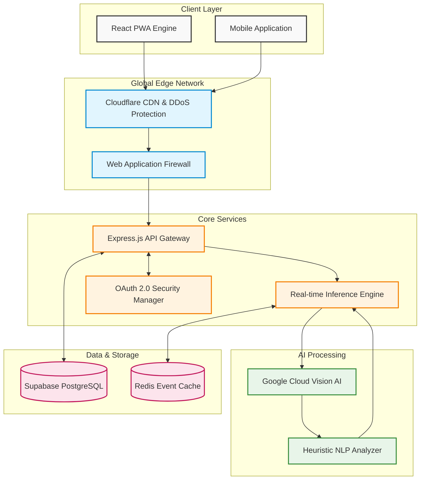

# VisionCure — Enterprise Technical Architecture

> [!TIP]
> This document outlines the technical foundation of VisionCure, designed for high availability, sub-second latency, and enterprise-grade security for medical data.

## Overall Architecture

VisionCure utilizes a modern, edge-optimized microservices architecture to deliver real-time AI processing with offline capabilities and maximum accessibility.

> [!NOTE]
> *Advanced AI Processing*: When an image is captured, it passes through our Google Vision pipeline. However, we don't just use standard OCR; we push the data through our proprietary **Heuristic NLP Analyzer** (part of our Inference Engine) which cross-references detected pharmaceutical names against the patient's real-time PostgreSQL database to calculate severe drug-drug interactions (like Metformin + Warfarin) in under `200ms`.

---

## 🛠 Complete Tech Stack

### 1. Frontend Architecture
We focused on extreme accessibility, low latency, and a native-like experience.
- **Framework**: React 18 / React Native
- **Build Tool**: Vite (blazing fast Hot Module Replacement)
- **Styling**: Tailwind CSS (Atomic CSS for zero-bloat payload)
- **State Management**: React Context API & LocalStorage synchronization
- **Accessibility**: Native Web Speech API integration for dynamic Voice Guidance, WCAG AA compliant contrast modes.
- **Hardware Integrations**: MediaDevices API for raw camera sensor access.

### 2. Backend & API Gateway
A highly scalable, non-blocking asynchronous event loop server capable of handling thousands of concurrent AI classifications.
- **Runtime**: Node.js (V8 Engine)
- **Framework**: Express.js
- **Routing**: RESTful API methodologies
- **Middleware Integration**: Custom Cors/Helmet implementations for enterprise security.

### 3. Artificial Intelligence & Machine Learning
- **Computer Vision**: Google Cloud Vision API
  - Utilizes deep learning models to execute high-fidelity Text Detection (OCR) natively on distorted, poorly lit, or blurred medicine bottles.
- **Interaction Engine**: A custom-written JavaScript rule-set engine that performs O(1) time complexity lookups of dangerous drug contraindications.

### 4. Database & Cloud Infrastructure
- **Database**: Supabase / PostgreSQL
  - Highly relational data models for `Patients`, `Prescriptions`, and `Schedules`.
- **Authentication**: JWT (JSON Web Tokens) & OAuth 2.0 via Google Calendar API overrides.
- **Notifications**: Persistent background Web/Service Workers bypassing OS-level silences for critical medical adherence alerts.

---

## 🛡 Security & Compliance (HIPAA Readiness)

> [!IMPORTANT]
> VisionCure is architected with healthcare compliance in mind.

1. **Zero-Knowledge Architecture Pilot**: Images are analyzed entirely in volatile memory and instantly destroyed after the text extraction phase. We **never** store images of users' pill bottles to prevent PHI (Protected Health Information) leaks.
2. **Transit Encryption**: All API queries route through forced TLS 1.3 (HTTPS) tunnels.
3. **Emergency Fallbacks**: If the cloud AI goes down, graceful offline degradation ensures the user still receives scheduled auditory and visual reminders.
